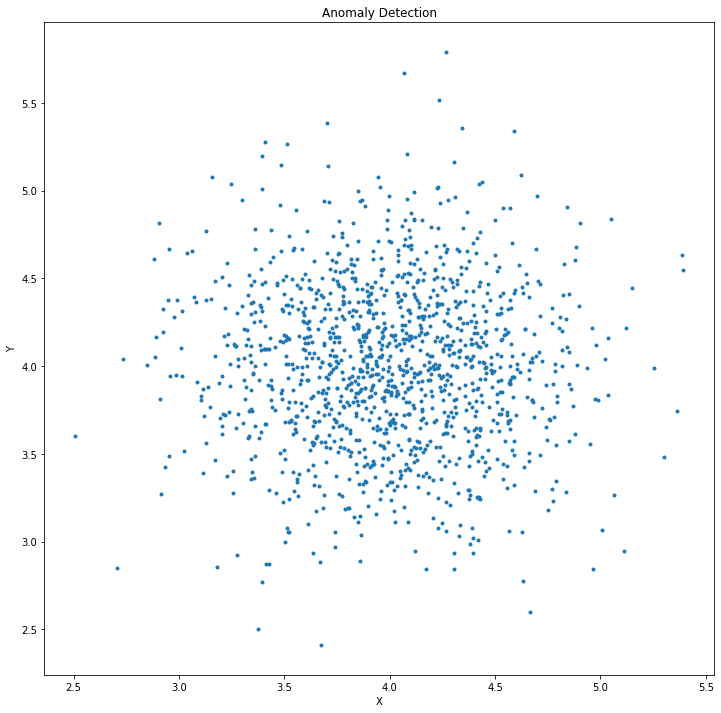
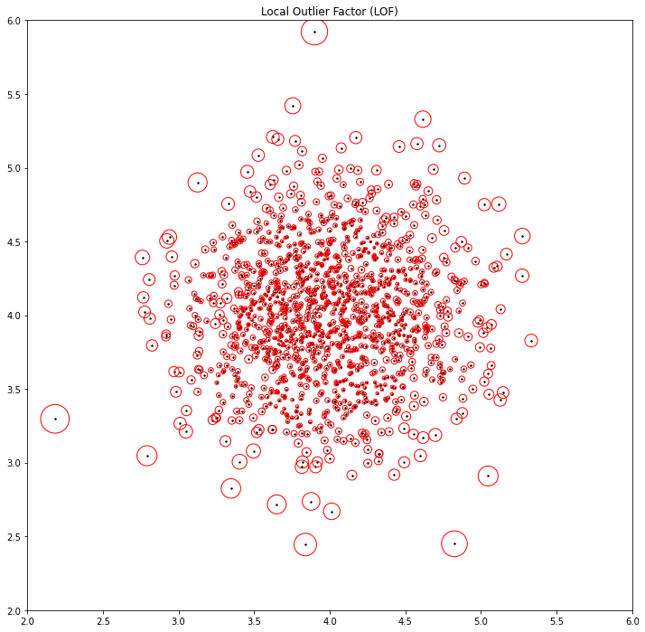
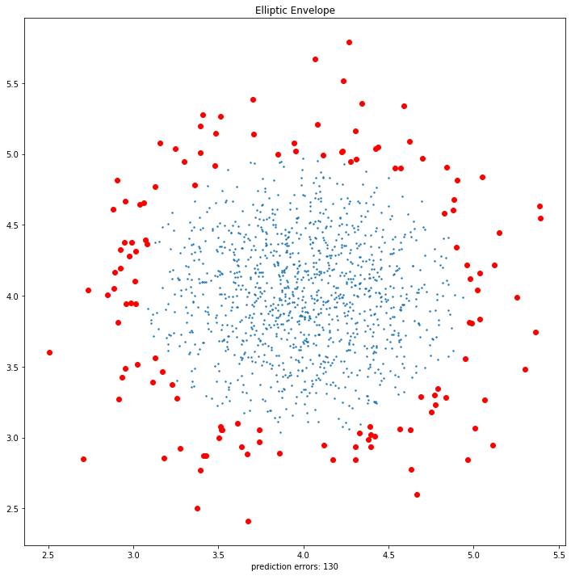
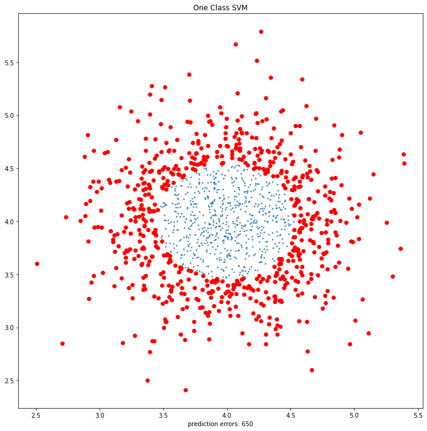
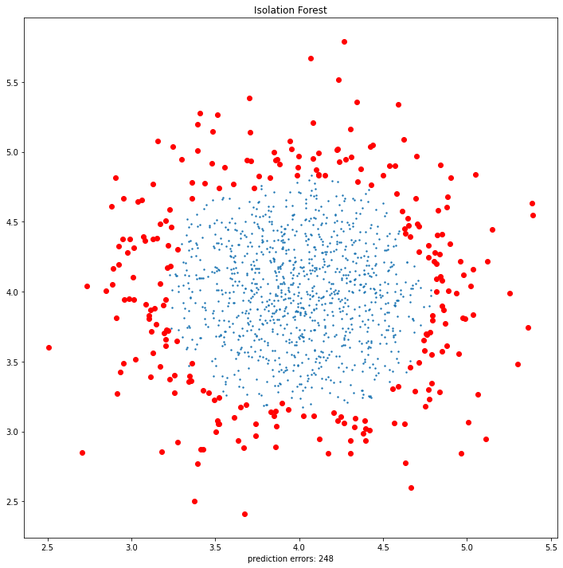

# Anomaly Detection

## Statement

In this project, I would like to present 4 different anomaly detection algorithms with an example. These  anomaly detection algorithms presented by sklearn. As listed:

 - [Local Outlier Factor](https://scikit-learn.org/stable/modules/generated/sklearn.neighbors.LocalOutlierFactor.html#sklearn.neighbors.LocalOutlierFactor)
   
 - [Elliptic Envelope](https://scikit-learn.org/stable/modules/generated/sklearn.covariance.EllipticEnvelope.html#sklearn.covariance.EllipticEnvelope)
  
 - [One Class SVM](https://scikit-learn.org/stable/modules/generated/sklearn.svm.OneClassSVM.html#sklearn.svm.OneClassSVM)
   
 - [Isolation Forest](https://scikit-learn.org/stable/modules/generated/sklearn.ensemble.IsolationForest.html)

     

### Dictionary meaning of the word anomaly

 1. Something different, abnormal, peculiar, or not easily classified  :
    something  anomalous  They regarded the test results as an anomaly.
    
 2. deviation from the common rule : IRREGULARITY
 
 3. The angular distance of a planet from its   as seen from the sun

### What is Anomaly Detection?

In data analysis, anomaly detection (also outlier detection) is the identification of rare items, events or observations which raise suspicions by differing significantly from the majority of the data. Typically the anomalous items will translate to some kind of problem such as bank fraud, a structural defect, medical problems or errors in a text. Anomalies are also referred to as outliers, novelties, noise, deviations and exceptions. 

Anomaly detection has 3 broad cathegories; **Unsupervised anomaly detection**,  **Supervised anomaly detection** and **Semi-supervised anomaly detection**. We are going to build Unsupervised anomaly detection with **Local Outlier Factor**, **Elliptic Envelope**, **One Class SVM** and **Isolation Forest**. 

### How to detect Anomalies?

Simple statistical techniques such as mean, median, quantiles can be used to detect univariate anomalies feature values in the dataset. Various data visualization and exploratory data analysis techniques can be also be used to detect anomalies.

## Dataset

We will compare their performance with a random sample dataset.

    from sklearn.datasets import make_blobs
    
    n_samples_1 = 1300
	X, y = make_blobs(n_samples=n_samples_1, centers=[[4, 4]], cluster_std=0.45)

As you can see from the code block, we generated 1300 samples with 0.45 standart deviaton. We mentioned our cluster center as x=4 and y=4 on coordinate plane. 

     

## Analysis

### Local Outlier Factor

Unsupervised Outlier Detection using the Local Outlier Factor (LOF).

The anomaly score of each sample is called the Local Outlier Factor. It measures the local deviation of the density of a given sample with respect to its neighbors. It is local in that the anomaly score depends on how isolated the object is with respect to the surrounding neighborhood. More precisely, locality is given by k-nearest neighbors, whose distance is used to estimate the local density. By comparing the local density of a sample to the local densities of its neighbors, one can identify samples that have a substantially lower density than their neighbors. These are considered outliers.

     

     

Figure on the above is shows LOF scores of data points. The data with **larger circle of radius** could be outlier data.

---

### Elliptic Envelope

Elliptic Envelope is an object for detecting outliers in a Gaussian distributed dataset.

     

---

### One Class SVM

Estimate the support of a high-dimensional distribution. The implementation is based on libsvm.

     

---

### Isolation Forest

Isolation forest is an anomaly detection algorithm. It detects anomalies using isolation, rather than modelling the normal points. In 2007, it was initially developed by **Fei Tony Liu** as one of the original ideas in his PhD study. The significance of this research lies in its deviation from the mainstream philosophy underpinning most existing anomaly detectors at the time, where all the normal instances are profiled before anomalies are identified as instances that do not conform to the distribution of the normal instances. Isolation forest introduces a different method that explicitly isolates anomalies using binary trees, demonstrating a new possibility of a faster anomaly detector that directly targets anomalies without profiling all the normal instances.

     

Process took 3.139817237854004 seconds.

## Sources

 - https://www.merriam-webster.com/dictionary/anomaly

 - https://en.wikipedia.org/wiki/Anomaly_detection

 - https://scikit-learn.org/stable/modules/generated/
 
 - https://towardsdatascience.com/5-anomaly-detection-algorithms-every-data-scientist-should-know-b36c3605ea16
 
 - https://medium.com/mlpoint/local-outlier-factor-a-way-to-detect-outliers-dde335d77e1a
 
 - https://en.wikipedia.org/wiki/Isolation_forest

**If you would like to dive in to anomaly detection, please visit these websites.**

## How to Run Code

Before running the code make sure that you have these libraries:

 - pandas 
 - time
 - numpy
 - sklearn
 - seaborn
 - matplotlib
    
## Contact Me

If you have something to say to me please contact me: 

 - Twitter: [Doguilmak](https://twitter.com/Doguilmak)  
 - Mail address: doguilmak@gmail.com
 
